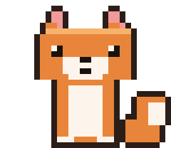

<h1 align="left">Hello There! I'm Shounak Joshi 🫧</h1>

<h3 align="left">Building agentic AI systems and real-stack apps that hold up when someone else runs them.</h3>

  <a href="https://github.com/shounakjoshi88-a11y/Flux"> <strong>Flux</strong></a> &nbsp;·&nbsp;
  <a href="https://github.com/shounakjoshi88-a11y/stellar-forge"> <strong>Stellar Forge</strong></a> &nbsp;·&nbsp;
  <a href="https://github.com/shounakjoshi88-a11y/de-ai"> <strong>de-ai</strong></a> &nbsp;·&nbsp;
  <a href="https://github.com/shounakjoshi88-a11y/meridian"> <strong>Meridian</strong></a> &nbsp;·&nbsp;
  <a href="https://x.com/BroIndian39416"> <strong>X</strong></a> &nbsp;·&nbsp;
  <a href="https://youtube.com/@A3-21-ShounakSamirkumarJoshi"> <strong>YouTube</strong></a> &nbsp;·&nbsp;
  <a href="mailto:shounakjoshi88@gmail.com"> <strong>Email</strong></a>

<!-- cat and about -->

<table>
  <tr>
    <td width="62%">
      
<b>💡 About me:</b>

      <ul>
        <li>BTech CSE (AI &amp; ML) at RCOEM, second year</li>
        <li>Building agentic systems that plan, execute, verify, and retry</li>
        <li>Real-time apps where the race conditions are the real problem</li>
        <li>Graphics and engines written from scratch, not configured</li>
      </ul>
      
The projects are small. The problems inside them are not.

    </td>
    <td width="38%" align="center">
      
    </td>
  </tr>
</table>

<h2 align="left">Tech Stack</h2>

<table>
  <tr>
    <td width="18%"><b>Languages</b></td>
    <td>
      
      
      
      
      
    </td>
  </tr>

  <tr>
    <td><b>Everyday</b></td>
    <td>
      
      
      
      
    </td>
  </tr>

  <tr>
    <td><b>Data</b></td>
    <td>
      
      
      
    </td>
  </tr>

  <tr>
    <td><b>Graphics</b></td>
    <td>
      
      
      
    </td>
  </tr>

  <tr>
    <td><b>Platform</b></td>
    <td>
      
      
      
    </td>
  </tr>
</table>

<h2 align="left">What I Build</h2>

**Flux**: twenty-one tools behind a plan, execute, verify, retry loop. The tools
were the easy part. Because streaming interleaves tool results with prose, the
verifier has to judge results it has not finished receiving, and vector memory
re-injects itself into later calls, so one bad extraction quietly poisons every
answer after it.

**Stellar Forge**: looks like a CRUD app with a 3D header, and the 3D header is
the easy part. Seat claims have to be race-safe across concurrent users, so
registration runs in serialisable transactions with row locking, and the live
counter is one source of truth rather than whatever each client last fetched.

**de-ai**: a rewriter that calls no model, so the same input gives the same
output every time. The cost of that determinism is that a rule bank will happily
turn `server` into `waiter`, so the lexical pass is fenced off from a
600-term technical blocklist, and the pipeline re-scans its own output and
reverts any swap that introduced a new tell.

**Meridian**: clinical triage built only from six lab practicals on real
ICD-10-CM data. No ORM because none was taught, no framework for the same reason.
The part I would not have guessed is that every generator bug ended up as a
named regression test rather than a quiet fix.

<h2 align="left">Now</h2>

**Voxelcraft**: a Minecraft-faithful sandbox in Godot 4.7 and C#. Greedy
meshing with smooth lighting and baked ambient occlusion, two-channel voxel light
propagation, multithreaded chunk streaming, and every asset generated from
scratch. Private until it is worth opening.

Also finishing **Raksha**, a Hackathon 2026 entry I lead on crowd safety. The
premise: crushing pressure passes body to body before a guard notices anyone has
stopped moving, so density and flow have to be measured rather than watched.

Open to internships, to collaboration, and to being told I am doing something in
a stupid way.

Earlier: [c-practice](https://github.com/shounakjoshi88-a11y/c-practice), where
the C came from, and
[60-login-page-challenge](https://github.com/shounakjoshi88-a11y/60-login-page-challenge),
sixty login screens in plain HTML and CSS.

<h2 align="left">Activity</h2>

Contribution history

<picture>
  <source media="(prefers-color-scheme: dark)" srcset="assets/activity-dark.svg">
  <source media="(prefers-color-scheme: light)" srcset="assets/activity-light.svg">
  
</picture>

Regenerated daily by <code>.github/workflows/activity.yml</code> and committed
into this repository, so it renders with no third-party service in the path.

---

  

Drawn as static SVG in <code>assets/</code> by me, not fetched from a badge
service, so nothing on this page can break or quietly rot. The fox is a
hand-drawn pixel sprite animated as a GIF, because GitHub strips inline SVG from
Markdown. Both themes are designed rather than inverted, and contrast clears
WCAG AA throughout.