Second year, so the projects are small. The problems inside them are not: two
people claiming the last seat in the same instant, a rewriter that will happily
turn `server` into `waiter`, a voxel mesh that has to stay smooth while four
threads stream chunks into it. Everything below is shipped, and for each one the
genuinely hard part is named rather than the feature list.

  <a href="https://github.com/shounakjoshi88-a11y/Flux"> <strong>Flux</strong></a> &nbsp;·&nbsp;
  <a href="https://github.com/shounakjoshi88-a11y/stellar-forge"> <strong>Stellar Forge</strong></a> &nbsp;·&nbsp;
  <a href="https://github.com/shounakjoshi88-a11y/de-ai"> <strong>de-ai</strong></a> &nbsp;·&nbsp;
  <a href="https://github.com/shounakjoshi88-a11y/meridian"> <strong>Meridian</strong></a> &nbsp;·&nbsp;
  <a href="https://x.com/BroIndian39416"> <strong>X</strong></a> &nbsp;·&nbsp;
  <a href="https://youtube.com/@A3-21-ShounakSamirkumarJoshi"> <strong>YouTube</strong></a> &nbsp;·&nbsp;
  <a href="mailto:shounakjoshi88@gmail.com"> <strong>Email</strong></a>

## The part that was hard

**Flux.** Twenty-one tools behind a plan, execute, verify, retry loop. The tools
were the easy part. Because streaming interleaves tool results with prose, the
verifier has to judge results it has not finished receiving — and vector memory
re-injects itself into later calls, so one bad extraction quietly poisons every
answer after it.

**Stellar Forge.** Looks like a CRUD app with a 3D header, and the 3D header is
the easy part. Seat claims have to be race-safe across concurrent users, so
registration runs in serialisable transactions with row locking, and the live
counter is one source of truth rather than whatever each client last fetched.

**de-ai.** A rewriter that calls no model, so the same input gives the same
output every time. The cost of that determinism is that a rule bank will happily
turn `server` into `waiter` — so the lexical pass is fenced off from a
600-term technical blocklist, and the pipeline re-scans its own output and
reverts any swap that introduced a new tell.

**Meridian.** Built under a hard constraint: only concepts from six lab
practicals. No ORM because none was taught, no framework for the same reason.
The part I would not have guessed is that every generator bug ended up as a
named regression test rather than a quiet fix.

## Now

**Voxelcraft** — a Minecraft-faithful sandbox in Godot 4.7 and C#. Greedy
meshing with smooth lighting and baked ambient occlusion, two-channel voxel light
propagation, multithreaded chunk streaming, and every asset generated from
scratch. Private until it is worth opening.

Also finishing **Raksha**, a Hackathon 2026 entry I lead on crowd safety. The
premise: crushing pressure passes body to body before a guard notices anyone has
stopped moving, so density and flow have to be measured rather than watched.

Open to internships, to collaboration, and to being told I am doing something in
a stupid way.

Earlier: [c-practice](https://github.com/shounakjoshi88-a11y/c-practice), where
the C came from, and
[60-login-page-challenge](https://github.com/shounakjoshi88-a11y/60-login-page-challenge),
sixty login screens in plain HTML and CSS.

## Stack

**Languages** — TypeScript, Python, C#, C, JavaScript
**Everyday** — Bun, Express, React, Tailwind, PostgreSQL with pgvector, Prisma
**Graphics** — Three.js, GSAP, Godot
**Platform** — Supabase, E2B, Docker, Linux, Git

## Activity

Contribution history

<picture>
  <source media="(prefers-color-scheme: dark)" srcset="assets/activity-dark.svg">
  <source media="(prefers-color-scheme: light)" srcset="assets/activity-light.svg">
  
</picture>

Regenerated daily by <code>.github/workflows/activity.yml</code> and committed
into this repository, so it renders with no third-party service in the path.

---

Drawn as static SVG in <code>assets/</code> by me, not fetched from a badge
service, so nothing on this page can break or quietly rot. Both themes are
designed rather than inverted, contrast clears WCAG AA throughout, and the motion
collapses to nothing under <code>prefers-reduced-motion</code>.