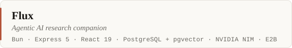
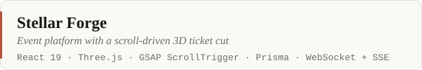
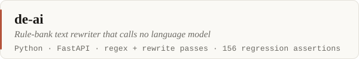

Second-year **B.Tech CSE (AI &amp; ML)** at Ramdeobaba University, Nagpur.
I build agentic AI systems, real-time web apps, and engines written from
scratch — mostly TypeScript and Python, with C# when the real problem is a
renderer.

The thread through most of it: I care far less about whether a demo works on
my own laptop than about whether it still holds up when someone else runs it.

  
  
  
  

## Selected work

- **[Flux](https://github.com/shounakjoshi88-a11y/Flux)** — a multi-model research
  companion built around a real agentic loop: plan the work, execute it under
  tool permissions, verify the result against criteria, retry what failed.
  Twenty-one registered tools, 1024-dimensional vector memory in pgvector,
  Python running in isolated Firecracker microVMs, a 3D knowledge graph, and
  a WebSocket agent protocol with team orchestration.
  [live](https://flux-weld-rho.vercel.app)

- **[Stellar Forge](https://github.com/shounakjoshi88-a11y/stellar-forge)** — event
  management where the ticket gets cut by a falling pair of scissors driven by
  scroll position: the blades track the perforation, the thread runs out
  mid-cut, and what is left swings free. Seats are claimed in serialisable
  transactions, so two people cannot both take the last one.
  [live](https://stellar-forge-frontend.vercel.app/)

- **[de-ai](https://github.com/shounakjoshi88-a11y/de-ai)** — a text rewriter that
  deliberately calls no model at all. Same input, same output, every run. A
  blocklist of 600+ technical terms that the lexical pass may never touch
  exists because `server → waiter` and `self-attention → elf-attention` are
  exactly the class of bug a naive synonym swap creates. 156 assertions pin
  the behaviour so a fix cannot silently regress.

- **[Meridian](https://github.com/shounakjoshi88-a11y/meridian)** — clinical records and
  symptom triage under a hard constraint: only concepts from six lab
  practicals. No ORM because none was taught, no frontend framework for the
  same reason. Runs on the real 98,403-code ICD-10-CM registry and 11,655 HPO
  rare conditions, and refuses to write any condition whose code is not
  already in that registry.

## Also worth a look

- **[Raksha](https://github.com/shounakjoshi88-a11y/raksha-crowd-safety-hackathon)**
  — team lead for a Hackathon 2026 entry on safety at large public events.
  The argument: crushing pressure passes body to body before a guard notices
  anyone has stopped moving, so density and flow have to be measured rather
  than watched.
- **[60-login-page-challenge](https://github.com/shounakjoshi88-a11y/60-login-page-challenge)**
  — sixty distinct login screens in plain HTML and CSS, one style per week.
- **[c-practice](https://github.com/shounakjoshi88-a11y/c-practice)** — where the C and
  the data structures came from.

## Currently

*October 2026*

- **Voxelcraft** — a Minecraft-faithful voxel sandbox in Godot 4.7 and C#.
  Greedy meshing with smooth lighting and baked ambient occlusion,
  two-channel voxel light propagation, multithreaded chunk streaming, and
  every asset procedurally generated from scratch. Private until it is worth
  opening.
- Finishing the Raksha submission for Hackathon 2026.
- Trying to write more C and less JavaScript.

## Stack

Shipped work, not aspiration — the repositories are the evidence.

**Languages** — TypeScript, Python, JavaScript, C#, C

**Runtime and data** — Bun, Express, PostgreSQL with pgvector, Prisma, React,
Tailwind, Three.js, GSAP

**Platform and tooling** — Supabase, Godot, Git, Linux, Docker

## Activity

Contribution history

<picture>
  <source media="(prefers-color-scheme: dark)" srcset="assets/activity-dark.svg">
  <source media="(prefers-color-scheme: light)" srcset="assets/activity-light.svg">
  
</picture>

Regenerated daily by <code>.github/workflows/activity.yml</code> and committed
straight into this repository, so it renders without any third-party image
service being up.

---

Every graphic here is a static SVG in <code>assets/</code> — no external
badge or stats service, so nothing on this page can break or rot. Both colour
themes are designed, not inverted, and the motion respects
<code>prefers-reduced-motion</code>.